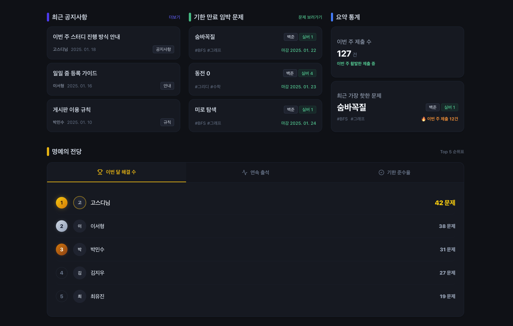
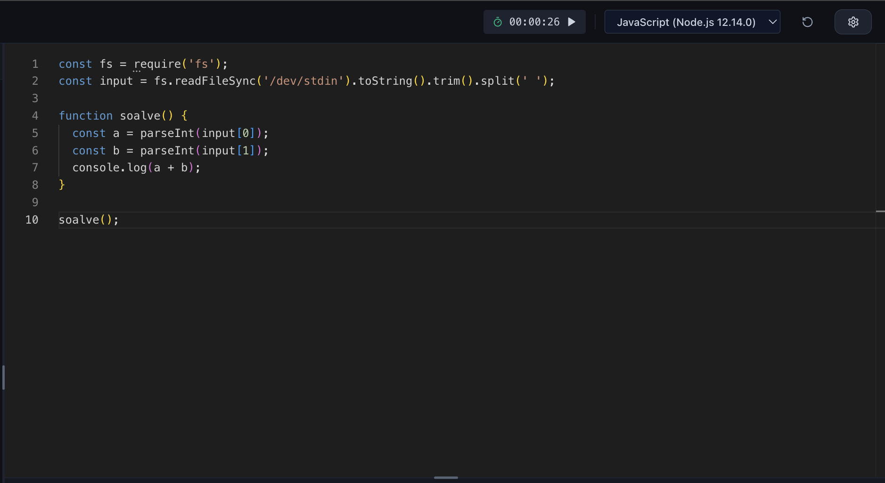
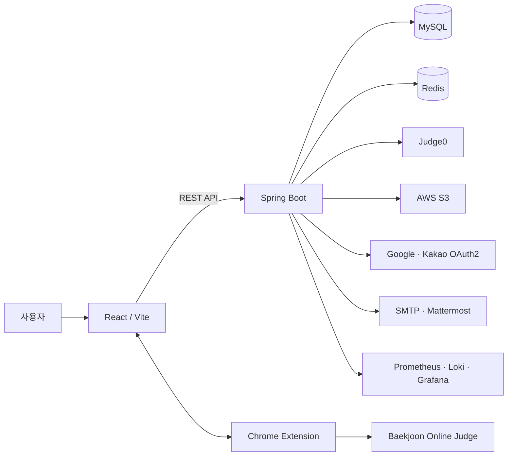
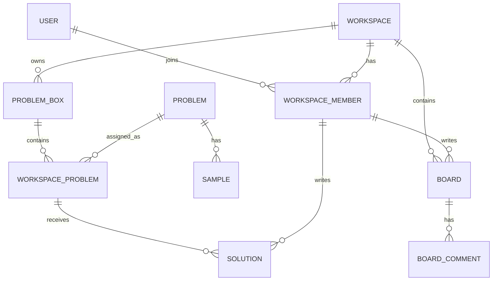

# UJAX

알고리즘 스터디의 문제 관리, 코드 실행, 백준 제출과 풀이 공유를 하나의 워크스페이스에서 이어주는 협업 플랫폼입니다.



스터디 운영자는 문제집과 마감일을 관리하고, 구성원은 웹 IDE에서 코드를 실행한 뒤 백준 제출 결과와 풀이를 공유할 수 있습니다. Judge0와 Chrome Extension을 함께 사용해 로컬 테스트와 실제 온라인 저지 제출을 분리했습니다.

## 주요 기능

- 역할 기반 워크스페이스 생성·가입·멤버 관리
- 백준 문제 수집과 문제집·마감일·알고리즘 태그 관리
- Monaco Editor 기반 웹 IDE와 Judge0 코드 실행
- Chrome Extension을 통한 백준 제출 및 결과 수집
- 풀이 버전 관리, 댓글·좋아요와 스터디 커뮤니티
- 제출 수·연속 출석·기한 준수율을 보여주는 대시보드
- Mattermost 웹훅 알림과 이메일 인증·초대 메일
- Prometheus·Loki·Grafana 기반 메트릭 및 로그 모니터링

## 서비스 화면

### 워크스페이스 대시보드

공지사항과 마감 임박 문제, 제출 통계 및 구성원 랭킹을 한 화면에서 확인합니다.


### 웹 IDE

문제별 코드와 언어를 저장하고, Judge0 실행 결과를 확인한 뒤 백준 제출 흐름으로 연결합니다.



대표 화면은 [Front PR #39](https://github.com/ujax-v2/ujax-front/pull/39)와 [Front PR #57](https://github.com/ujax-v2/ujax-front/pull/57)에 첨부된 실제 화면입니다.

## 프로젝트 구성

| 저장소 | 역할 |
|---|---|
| [`ujax-server`](https://github.com/ujax-v2/ujax-server) | Spring Boot API, 인증, 워크스페이스·문제·풀이 도메인, Judge0 연동 |
| [`ujax-front`](https://github.com/ujax-v2/ujax-front) | React 기반 대시보드, 커뮤니티, 문제 관리와 웹 IDE |
| [`ujax-extension`](https://github.com/ujax-v2/ujax-extension) | 브라우저 로그인 세션을 이용한 백준 제출·결과 확인 |
| [`ujax-api-spec`](https://github.com/ujax-v2/ujax-api-spec) | REST Docs에서 생성한 OpenAPI 명세와 TypeScript 타입 |

## 시스템 구조



사용자가 IDE에서 실행한 코드는 Judge0에서 격리 실행합니다. 실제 백준 제출은 서버가 사용자의 세션을 대신 보관하지 않도록 Chrome Extension이 브라우저의 로그인 상태를 이용해 처리합니다. 자세한 요청 흐름과 ERD·유즈케이스는 [아키텍처 문서](docs/architecture.md)에서 확인할 수 있습니다.

## 기술적 구현

### 실행과 제출을 분리한 채점 흐름

웹 IDE의 빠른 테스트는 Judge0 API로 전달하고 상태를 polling해 결과를 반환합니다. 백준 제출은 Cloudflare와 로그인 세션 제약 때문에 확장 프로그램으로 분리했습니다. 프론트와 Extension 사이의 연결 상태를 확인한 뒤 제출 페이지를 열어 사용자가 최종 제출 흐름을 이어갈 수 있도록 구성했습니다.

### 워크스페이스 중심의 협업 모델

사용자와 워크스페이스 사이에 `WorkspaceMember`를 두어 OWNER·MANAGER·MEMBER 권한을 구분했습니다. 문제집에 백준 문제와 마감일을 배정하고, 구성원의 풀이·댓글·좋아요·게시글이 워크스페이스 안에서 연결되도록 설계했습니다.

### API 명세를 공유하는 저장소 경계

서버의 REST Docs 테스트에서 OpenAPI 명세를 생성하고 `ujax-api-spec`에서 TypeScript 타입으로 변환합니다. 프론트가 같은 타입을 패키지로 가져가도록 해 서버 응답과 화면 모델의 불일치를 줄였습니다.

### 비동기 알림과 운영 관측

회원가입과 워크스페이스 초대 메일은 Outbox에 저장한 뒤 스케줄러가 재시도합니다. 문제 등록과 마감 알림은 Mattermost 웹훅으로 전달하며 URL 원문은 응답과 로그에 노출하지 않습니다. 애플리케이션 메트릭과 컨테이너 로그는 Prometheus·Loki·Grafana로 확인합니다.

## 핵심 데이터 모델



전체 관계와 기능별 유즈케이스는 [설계 문서](docs/architecture.md#핵심-erd)에 정리했습니다.

## 기술 스택

| 영역 | 기술 |
|---|---|
| Server | Java 21, Spring Boot 3.5, Spring Data JPA, QueryDSL, Spring Security |
| Data | MySQL 8, Redis, Flyway |
| Client | React 18, TypeScript, Vite, Recoil, MUI, Tailwind CSS, Monaco Editor |
| Integration | Judge0, Chrome Extension, OpenAPI, Spring REST Docs, AWS S3 |
| Infra | Docker Compose, AWS EC2, GitHub Actions |
| Observability | Spring Actuator, Micrometer, Prometheus, Loki, Promtail, Grafana |
| Test | JUnit 5, MockMvc, Spring Security Test, JaCoCo |

## Team Contributions

### 박민용 · [@minyongP](https://github.com/minyongP)

**역할 — 워크스페이스·커뮤니티 도메인과 알림·운영 안정성 개발**

- 워크스페이스 및 멤버 API를 구현하고 가입 신청·승인·취소 흐름과 역할별 권한을 분리했습니다.
- 게시판 API와 작성자 보존 정책을 구현하고, 탈퇴하거나 삭제된 멤버의 게시글·댓글 조회 문제를 수정했습니다.
- 워크스페이스 이미지 업로드와 조회를 S3 Presigned URL 방식으로 연결했습니다.
- 문제 마감 알림 배치와 Mattermost 웹훅 전송을 구현하고 URL 마스킹, HTTP client·formatter·전송 계층을 분리했습니다.
- 회원가입 이메일 인증과 Mail Outbox 기반 재시도 구조, SMTP 템플릿을 구현했습니다.
- Flyway 마이그레이션과 도메인 조회 인덱스를 추가하고 컨테이너별 로그 분리 및 구조화 로그를 정리했습니다.
- 관련 작업: [Server #6](https://github.com/ujax-v2/ujax-server/pull/6), [#12](https://github.com/ujax-v2/ujax-server/pull/12), [#36](https://github.com/ujax-v2/ujax-server/pull/36), [#44](https://github.com/ujax-v2/ujax-server/pull/44), [#66](https://github.com/ujax-v2/ujax-server/pull/66), [#85](https://github.com/ujax-v2/ujax-server/pull/85), [#97](https://github.com/ujax-v2/ujax-server/pull/97)

### 권광재 · [@kwongwangjae](https://github.com/kwongwangjae)

**역할 — 인증·문제·풀이 API와 프론트엔드·Extension 통합 개발**

- JWT·Spring Security·Google/Kakao OAuth2 인증 구조와 사용자 도메인을 구축했습니다.
- 백준 문제 수집, 문제집 CRUD, 워크스페이스 문제 검색과 QueryDSL 조회를 구현했습니다.
- 제출 결과를 풀이와 버전으로 수집하고 댓글·좋아요 등 구성원 상호작용 API를 구현했습니다.
- 대시보드, 문제집, 설정, 프로필, 커뮤니티와 Monaco IDE를 서버 API에 연결하고 권한별 UI를 구성했습니다.
- IDE 코드·언어·사용자 예제 저장, 실행·제출 상태 처리, 결과 상세 화면과 HTML sanitizing을 구현했습니다.
- Chrome Extension의 인증 갱신, 제출 상태 복구와 프론트 연결 handshake를 보강했습니다.
- REST Docs 기반 OpenAPI 명세와 TypeScript 타입을 관리해 서버·클라이언트 계약을 동기화했습니다.
- 관련 작업: [Server #9](https://github.com/ujax-v2/ujax-server/pull/9), [#31](https://github.com/ujax-v2/ujax-server/pull/31), [#43](https://github.com/ujax-v2/ujax-server/pull/43), [#54](https://github.com/ujax-v2/ujax-server/pull/54), [#80](https://github.com/ujax-v2/ujax-server/pull/80), [Front #29](https://github.com/ujax-v2/ujax-front/pull/29), [#89](https://github.com/ujax-v2/ujax-front/pull/89), [#109](https://github.com/ujax-v2/ujax-front/pull/109)

### 이진욱 · [@jinukee](https://github.com/jinukee)

**역할 — Judge0 채점 연동과 배포·모니터링 환경 구축**

- Judge0 제출 API와 polling 기반 채점 결과 조회를 구현하고 언어·응답 매핑 및 예외 처리를 정리했습니다.
- Judge0 worker와 queue 설정을 운영 규모에 맞게 조정하고 애플리케이션 서버와 채점 서버의 배포 구성을 분리했습니다.
- 서버·프론트 GitHub Actions 배포 workflow와 Docker 운영 구성을 만들었습니다.
- Prometheus, Loki, Promtail, Grafana를 연결해 JVM·컨테이너 메트릭과 Spring Boot 로그를 수집했습니다.
- 로그인 이벤트를 바탕으로 DAU·MAU·YAU 지표를 수집하고 Grafana Cloud 전환 작업을 진행했습니다.
- 운영 환경의 문자 인코딩과 시간대 차이로 발생한 서버·클라이언트 표시 오류를 수정했습니다.
- 관련 작업: [Server #8](https://github.com/ujax-v2/ujax-server/pull/8), [#50](https://github.com/ujax-v2/ujax-server/pull/50), [#70](https://github.com/ujax-v2/ujax-server/pull/70), [#93](https://github.com/ujax-v2/ujax-server/pull/93), [Front #50](https://github.com/ujax-v2/ujax-front/pull/50), [#69](https://github.com/ujax-v2/ujax-front/pull/69)

### 성지훈 · [@JunOnJuly](https://github.com/JunOnJuly)

**역할 — 워크스페이스·대시보드·커뮤니티 UX 설계 및 프론트엔드 구현**

- 홈 화면을 풀스크린 흐름으로 개편하고 서비스 진입 구조와 한국어 UI를 정리했습니다.
- 워크스페이스 대시보드, 사이드바와 탐색 구조를 재설계하고 공지·통계·랭킹의 정보 위계를 개선했습니다.
- 문제집 목록과 문제 풀이방을 개편하고 워크스페이스 프로필 정보와 전역 사용자 상태를 연결했습니다.
- 마이페이지를 리뉴얼하고 연속 출석 등 학습 활동 정보를 표시했습니다.
- 커뮤니티 탭을 통합하고 태그 필터, 검색과 게시글 작성 화면을 구현했습니다.
- 반응형 레이아웃과 다크 테마에서 메뉴 간격·텍스트 시인성 등 화면 완성도를 개선했습니다.
- 관련 작업: [Front #6](https://github.com/ujax-v2/ujax-front/pull/6), [#8](https://github.com/ujax-v2/ujax-front/pull/8), [#10](https://github.com/ujax-v2/ujax-front/pull/10), [#14](https://github.com/ujax-v2/ujax-front/pull/14), [#15](https://github.com/ujax-v2/ujax-front/pull/15), [#17](https://github.com/ujax-v2/ujax-front/pull/17)

## 로컬 확인

외부 OAuth, SMTP, S3와 Judge0 연동에는 별도 인증정보와 실행 환경이 필요합니다. 저장소에는 실제 운영 값을 포함하지 않습니다.

```bash
# Server test
./gradlew test

# Server local run
docker compose up -d mysql redis
SPRING_PROFILES_ACTIVE=local ./gradlew bootRun

# Client
git clone https://github.com/ujax-v2/ujax-front.git
cd ujax-front
npm install
npm run dev
```

Chrome Extension 설치와 백준 제출 흐름은 [`ujax-extension`](https://github.com/ujax-v2/ujax-extension)을 참고해주세요.
