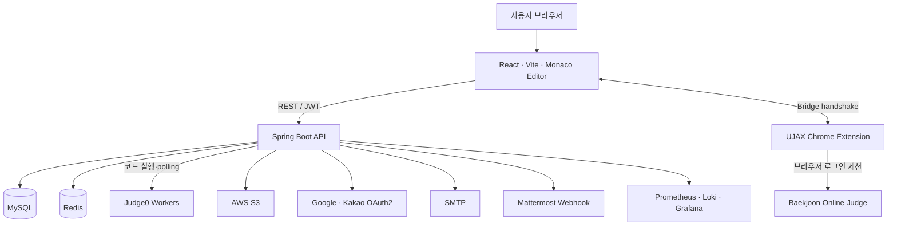
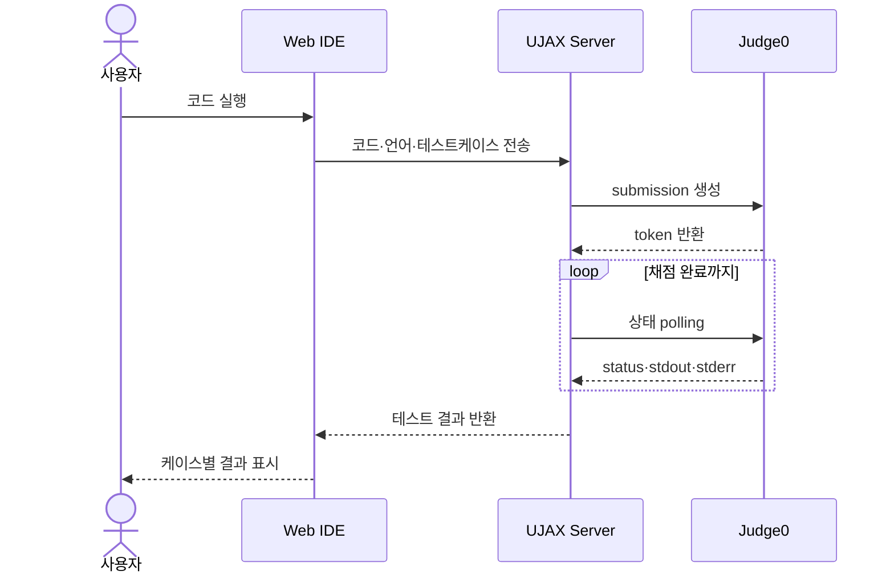
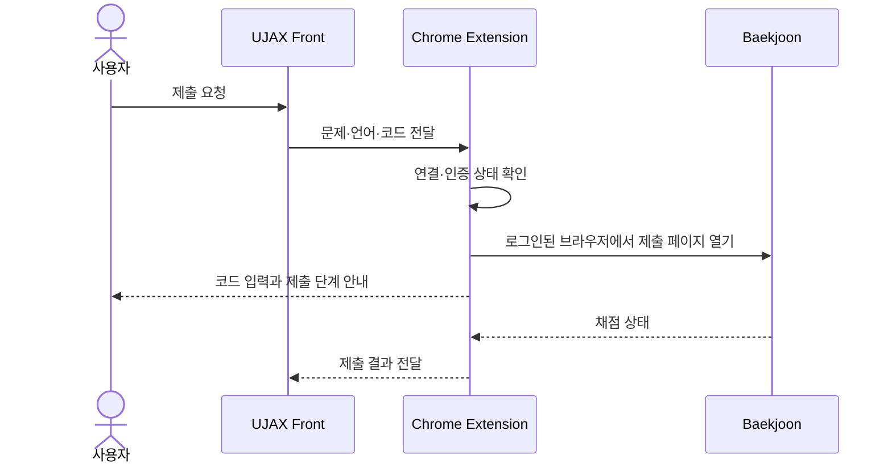
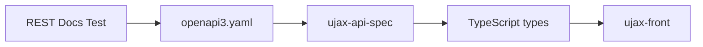
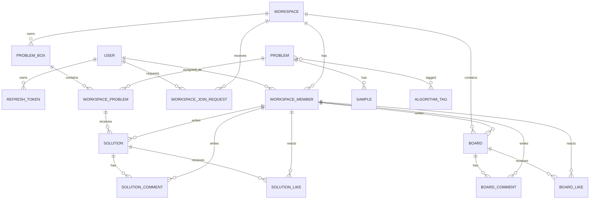
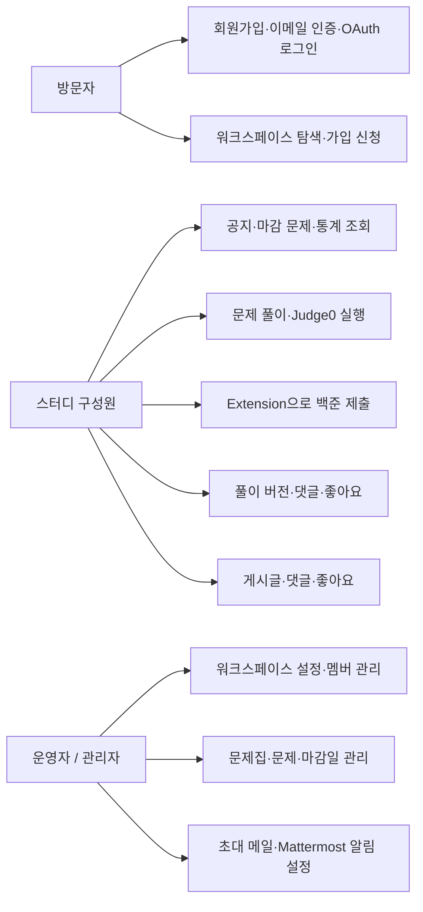

# UJAX Architecture

UJAX는 프론트엔드, API 서버, 코드 실행 환경과 백준 제출용 Chrome Extension을 분리합니다. 서버가 사용자의 백준 로그인 정보를 보관하지 않으면서도 웹 IDE의 코드 실행과 실제 온라인 저지 제출을 하나의 흐름으로 연결하기 위한 구조입니다.

## 시스템 아키텍처

## 주요 요청 흐름

### Judge0 코드 실행

### 백준 제출

### 명세 동기화

## 핵심 ERD

ERD는 현재 JPA 엔티티의 연관관계를 기준으로 핵심 협업 도메인만 표현했습니다. 이메일 Outbox와 웹훅 알림 로그처럼 독립적으로 재시도·감사 이력을 관리하는 운영 테이블은 가독성을 위해 제외했습니다.

## 유즈케이스

## 저장소 경계

- [`ujax-server`](https://github.com/ujax-v2/ujax-server): 도메인 규칙, API, 인증, 실행·알림 연동
- [`ujax-front`](https://github.com/ujax-v2/ujax-front): 사용자 화면과 클라이언트 상태
- [`ujax-extension`](https://github.com/ujax-v2/ujax-extension): 백준 브라우저 세션을 사용하는 제출 연결
- [`ujax-api-spec`](https://github.com/ujax-v2/ujax-api-spec): 서버와 프론트가 공유하는 API 계약
